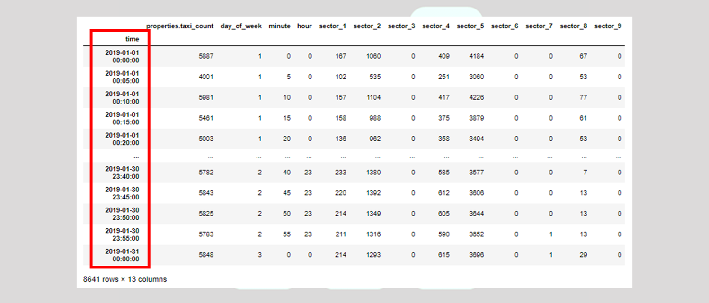

  

<h1 align="center">Taxi Availability Singapore</h1>

 In Singapore, all of the taxis are connected to a central system that tracks their positions at all times. It's even cooler because the Singaporean government collects these data and anyone - including you - can obtain the data for analysis.
So I will collect the data for one month in 2019, and perform analysis, followed by modelling.

## 📝 Table of Contents

- [Data](#problem_statement)
- [Flow of project](#project)
- [Part 1 - Data Collection and Mining](#1)
- [Part 2 - Data Cleaning](#2)
- [Part 3 - Data Engineering](#3)
- [part 4 - Machine Learning](#4)
- [Acknowledgments](#acknowledgments)

## 🗂 Data 
The data is from Singapore government provided API at https://data.gov.sg/dataset/taxi-availability.
</a>
## Flow of project 

1. Call the taxi availability API from Data.gov.sg to collect taxi data (Part I)
2. Perform data cleaning (Part II)
3. Perform exploratory data analysis (Part III)
4. Train a machine learning model to (Part IV)

## Part 1 

- Import your pandas library
- Call the Taxi Availability API from Data.gov.sg
- Organize the JSON data
- Export your DataFrame as a CSV file

## Part 2 
</a>
- Load the CSV that you obtained from Part I
- Convert the string representation of lists as actual lists
- Divide the coordinates of taxis into different sectors
- Engineer new features out of the time data
- Drop unneeded columns
- Export the engineered DataFrame

### Part 3 
</a>
- Import pandas and data vizualization libraries
- Visualize the taxi availability over the month
- Visualize the taxi availability over the 24 hours in a day
- Visualize the taxi availability by day of the week

### Part 4 

- Split your data into train and test set
- Model creation
- Import your models from sklearn and instantiate them (assign model object to a variable)
- model fitting
- Fit your training data into the model and train train train
- model prediction
- Make a set of predictions using your test data, and
- Model assessment
- Compare your predictions with ground truth in test data

## 🎉 Acknowledgments 

- Tribe Academy

